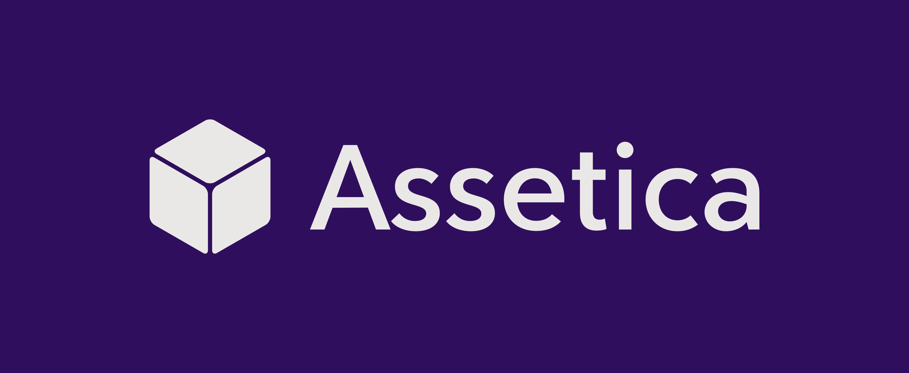
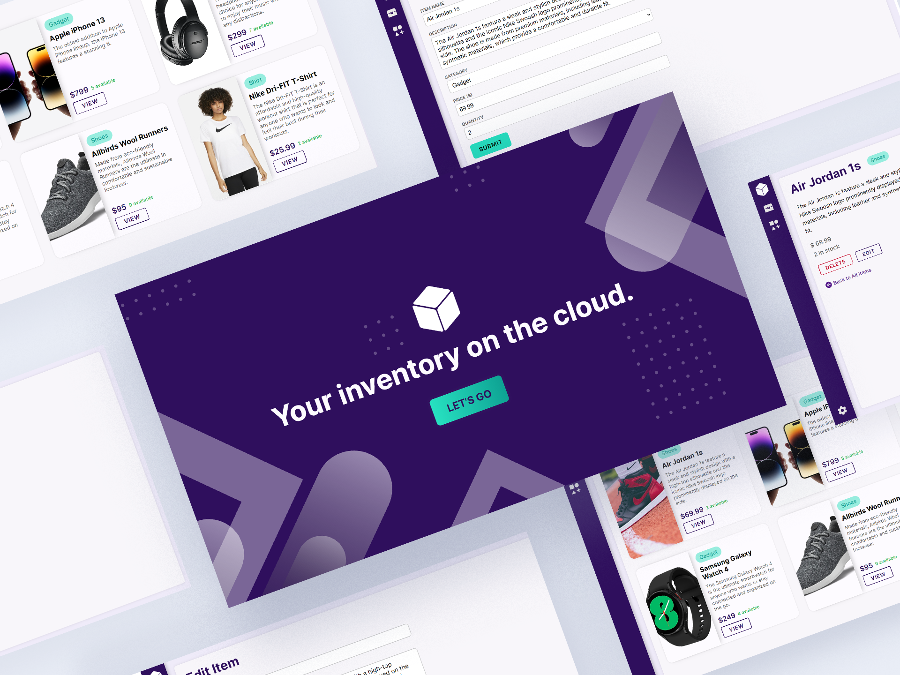

# Assetica



A cloud-based inventory management web application for the modern consumer. Powered by an Express.js REST API web servvi hosted on [Render.com](https://render.com/) that fetches data from a NoSQL [MongoDB](https://www.mongodb.com/) database cluster and performs HTML server-side rendering with EJS.

## Database Schema

This schema was made with [QuickDBD](https://www.quickdatabasediagrams.com/) for visualizing the relationships between the Mongoose Models.

- an `Item`'s `category` array field can have **1 or many** `Category` objects.
- a single `Category` object can belong to **0 or many** `Item` objects at any time.
- `URL` Strings are [Mongoose Virtuals](https://mongoosejs.com/docs/tutorials/virtuals.html) that are based on the base route URL and the `Schema.Types.ObjectId`.


```js
const ItemSchema = new Schema({
  name: { type: String, required: true, trim: true },
  description: { type: String, required: true, trim: true },
  category: { type: Schema.Types.ObjectId, ref: 'Category', required: true },
  price: { type: Number, required: true },
  in_stock: { type: Number, required: true, min: 0, default: 0 },
});

ItemSchema.virtual('URL').get(function () {
  return `/item/${this._id}`;
});

const CategorySchema = new Schema({
  name: { type: String, required: true, trim: true },
  description: { type: String, required: true, trim: true },
});

CategorySchema.virtual('URL').get(function () {
  return `/category/${this._id}`;
});
```

## Mockups



